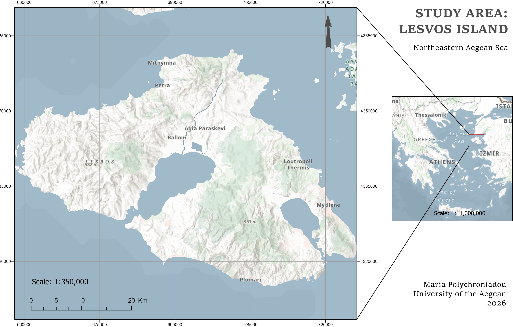
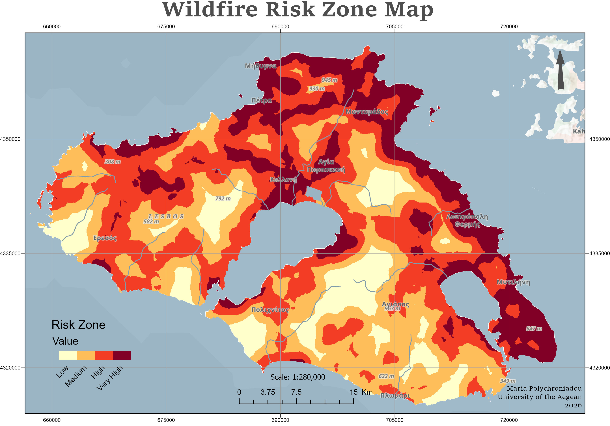

# Wildfire Ignition Risk Map for Lesvos Island

A spatial logistic regression model that estimates relative wildfire ignition risk across Lesvos, Greece, from terrain and human-infrastructure variables. Built with ArcGIS Pro, Python and SPSS.

## Key results

| | |
|---|---|
| Sample | 795 points (397 fire, 398 no-fire) |
| Overall classification accuracy | 65.4% (520 of 795 points) |
| Sensitivity / Specificity | 68.3% / 62.6% |
| Hosmer-Lemeshow test | χ² = 4.330, df = 8, p = 0.826 |
| Significant predictors (p < 0.05) | 5 of 10 variables |

The model has **moderate** predictive power. It is best read as a relative susceptibility map, not an exact probability forecast.

## Study area

Lesvos, in the northeastern Aegean Sea, has rugged terrain, a Mediterranean climate and a mix of semi-natural forest, shrubland and farmland. The island has a history of large wildfires, including the July 2022 fire that spread quickly through pine forest, scrub and cultivated land and led to the evacuation of 450 residents.

## Data

- **Fire points:** recorded wildfire ignition points (value 1) `[source, years covered]`.
- **No-fire points:** random points with no fire (value 0), generated with a "random dates, no fires" method.
- **Terrain:** DEM (elevation), slope in degrees (derived from the DEM), X and Y coordinates.
- **Distance rasters:** distance to settlements, agricultural areas, main road, secondary road, power lines and landfills.
- **Data provenance:** `[who provided the datasets / original sources]`.

## Methodology

1. **Pre-processing (ArcGIS Pro):** set the processing extent and mask to the DEM. Created X and Y coordinate rasters with Python (`SingleOutputMapAlgebra`). Computed slope from the DEM. Split the road network into main (ID 1) and secondary (ID 2) roads and computed Euclidean distance rasters.
2. **Normalisation:** rescaled every raster to 0-1 with min-max normalisation in the Raster Calculator: `X' = (X − Xmin) / (Xmax − Xmin)`.
3. **Sampling:** used *Extract Multi Values to Points* to attach the raster values to each point, and created a binary `fire` field as the dependent variable.
4. **Model (SPSS):** exported the attribute table to CSV and ran a Binary Logistic Regression with `fire` as the dependent variable and the 10 normalised variables as predictors.
5. **Evaluation:** classification table (cut value 0.5), sensitivity and specificity, Hosmer-Lemeshow test and the observed groups and predicted probabilities plot.
6. **Risk map:** applied the fitted equation in the ArcGIS Raster Calculator, `P = 1 / (1 + e^(−z))`, and divided the result into 4 risk zones (low to very high) `[classification method]`.

## Results

### Model performance

| | Predicted no fire | Predicted fire |
|---|---|---|
| **Observed no fire** | 249 | 149 |
| **Observed fire** | 126 | 271 |

Sensitivity is 271 / (271 + 126) = 68.3% and specificity is 249 / (249 + 149) = 62.6%. The two classes overlap around the 0.5 cut value, so the model cannot separate them cleanly.

### Significant variables

| Variable | B | p | Effect on ignition risk |
|---|---|---|---|
| Y coordinate | 1.800 | < 0.001 | Higher in the north |
| Distance to landfills | 2.390 | < 0.001 | Increases with distance |
| Distance to power lines | −2.743 | 0.002 | Increases closer to power lines |
| Distance to settlements | −2.266 | 0.002 | Increases closer to settlements |
| Distance to secondary road | 0.898 | 0.036 | Increases with distance |

Not significant: distance to main road, distance to agricultural areas, slope, elevation and X coordinate. In this study area, human-infrastructure variables were more informative than topography.

### Risk map

Very high and high risk zones appear mainly in the north (around Mithymna and Mantamados) and in the east, including the area around Mytilene. Smaller high-risk patches are scattered across the island. The lowest risk is in the lowland plains, around the Gulf of Kalloni and in the west near Eresos.

## Limitations

- The model uses spatial variables only. Wind, humidity, temperature and fuel moisture are not included, and they strongly affect ignition and spread.
- Accuracy is measured on the same sample used to fit the model. There is no independent test set.
- No-fire points are random, and the sample is balanced 50/50 by design. The output is therefore a relative risk index, not the true probability of a fire at a location.
- The Y coordinate is significant but is a geographic proxy, not a cause. It likely captures effects the model doesn't measure directly.
- Significant distance variables show association, not causation. Distance to landfills and secondary roads may partly reflect how remote or forested an area is.
- Next steps: add climate and vegetation data (e.g. NDVI from Sentinel-2), validate on a held-out set or with spatial cross-validation, and compare with other models such as random forest.

## Tools

ArcGIS Pro (Raster Calculator, Euclidean Distance, Slope, Extract Multi Values to Points), Python (`arcpy`) and SPSS (Binary Logistic Regression).

## Reference

Vilar del Hoyo, L., Martín Isabel, M. P., & Martínez Vega, F. J. (2011). Logistic regression models for human-caused wildfire risk estimation: Analysing the effect of the spatial accuracy in fire occurrence data. *European Journal of Forest Research*, 130(6), 983-996. https://doi.org/10.1007/s10342-011-0488-2

*Project developed at the University of the Aegean, Department of Geography.*
